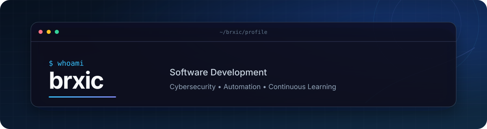

  

   

  <a href="https://github.com/brxic?tab=repositories">Explore my projects</a>

## About me

I'm an IT trainee from Switzerland focused on software development, automation, and cybersecurity. I learn by building practical projects—and away from the keyboard, I enjoy music, gaming, and floorball.

## Tech stack

  

## Contribution trail

  <picture>
    <source media="(prefers-color-scheme: dark)" srcset="https://raw.githubusercontent.com/brxic/brxic/output/github-snake-dark.svg" />
    <source media="(prefers-color-scheme: light)" srcset="https://raw.githubusercontent.com/brxic/brxic/output/github-snake.svg" />
    
  </picture>

  <a href="https://www.linkedin.com/in/basil-ramseyer/">LinkedIn</a>
  &nbsp;&bull;&nbsp;
  <a href="https://www.instagram.com/ba_08sil/">Instagram</a>
  &nbsp;&bull;&nbsp;
  <a href="https://discord.com/users/778910708310081549">Discord</a>
  &nbsp;&bull;&nbsp;
  <a href="https://tryhackme.com/r/p/brxic">TryHackMe</a>

    

  Always learning. Always building.

